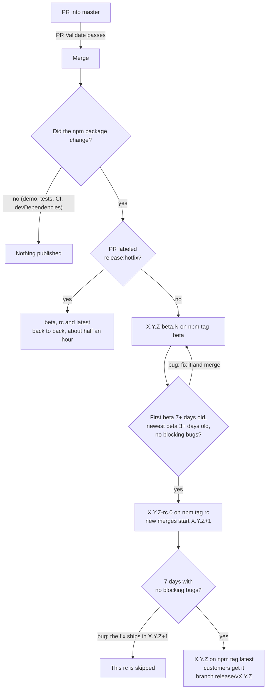
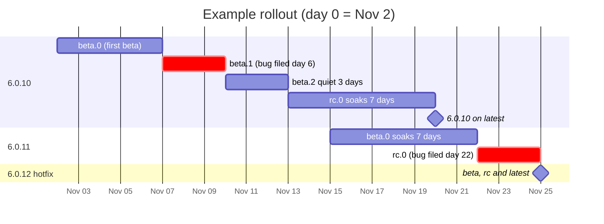

# Releasing ryuu.js

Releases are automatic. You merge PRs into `master`; GitHub Actions decides when each change is ready for customers. Nobody runs `npm publish` by hand. A typical change reaches customers about two weeks after it merges; a PR labeled `release:hotfix` reaches them in about half an hour.

- [The release cycle](#the-release-cycle)
- [The rules](#the-rules)
- [Hotfixes](#hotfixes)
- [Example rollout](#example-rollout)
- [Interrupts: what happens if…](#interrupts-what-happens-if)
- [Testing it yourself](#testing-it-yourself)
- [Settings](#settings)
- [One-time setup](#one-time-setup)
- [Recovery](#recovery)

## The release cycle



| npm tag | Example | Who gets it |
|---|---|---|
| `latest` | `6.0.10` | **Customers.** `npm install ryuu.js`, CDN URLs without a version, and npm installs of ranges like `^6.0.9` |
| `rc` | `6.0.10-rc.0` | Anyone who asks for `ryuu.js@rc` |
| `beta` | `6.0.10-beta.3` | Anyone who asks for `ryuu.js@beta` |

Betas and rcs are prereleases. No package manager installs one from a normal range like `^6.0.9`, so customers only ever move to a version that passed both soaks, or that was shipped as a hotfix.

## The rules

1. **Every PR** runs PR Validate (type check, tests, build, package contents). It must pass to merge.
2. **After a merge**, Release builds `master` and compares the npm package with the last one published. A changed package becomes the next beta. A merge that only touches the demo, tests, CI or devDependencies publishes nothing. README changes do publish a beta, because npm shows the README on the package page.
3. **A version moves from beta to rc** once its **first** beta is 7 days old, its **newest** beta is 3 days old, and it has no blocking bugs. A new beta restarts only the 3-day quiet clock, and once the first beta is 14 days old the quiet period is waived, so steady merging can delay a release by at most a couple of weeks and never block it. Once the rc is cut, the next merge that changes the package starts the next patch version.
4. **An rc that reaches 7 days with no blocking bugs** is published as `latest`, with a `vX.Y.Z` tag and a `release/vX.Y.Z` branch. Each step ships the exact build that soaked; only the version number changes.
5. **A PR labeled `release:hotfix`** by a maintainer or admin before it merges skips both soaks and the Jira check. See [Hotfixes](#hotfixes).
6. **A bug blocks a version** when it's a Jira **Bug** labeled `ryuu.js-X.Y.Z` (no `-beta`/`-rc` suffix), and it's either still unresolved, or was reported during the current soak and wasn't closed as Duplicate, Won't Do, Won't Fix, Cannot Reproduce or Not a Bug. All priorities count.
7. **Release runs** after every merge, daily at 15:23 UTC, and after every publish, but only while `RELEASE_ENABLED` is `true`. It also runs whenever you click Run workflow, whatever that setting is. Each run does at most one thing, in this order: retry a failed publish, a manual override, a hotfix, release a soaked rc, promote a soaked beta, cut a beta.

## Hotfixes

To get a fix to customers right away, a **maintainer or admin** adds the **`release:hotfix`** label to its PR **before merging**. The PR still needs review and passing checks to merge. After the merge, Release publishes the beta, the rc and `latest` back to back, about half an hour in all, because npm checks each new version for a few minutes before it lists it and every step waits for that. Each step still builds, tests, verifies the tag and checks that the package is identical to the step before.

- **Only a maintainer or admin counts, and only before the merge.** Release looks at who applied the label and when. A label from anyone else, or one added after the merge, is ignored with a note in the run log, and the change goes through the normal soak. (Roles are `HOTFIX_ROLES` in `scripts/ci/lib.ts`.)
- **Release checks the latest commit on `master`.** Because every PR is squash-merged, that commit is one PR. If another PR lands before Release runs (say Dependabot merges right behind the hotfix), the latest commit is no longer the hotfix and the change goes through the normal soak. That can only make it slower, never faster; an admin can still use `force_rc` and `force_ga`.
- **It ships everything on `master` that isn't released yet**, not just the fix, because every release is cut from `master`.
- **A hotfix takes priority** over a normal promotion that happens to be due, and it never asks Jira, so a Jira outage can't hold one up. Any rc still soaking is superseded: it ends up below `latest` and never ships on its own, since its changes are in the hotfix.
- **If the PR doesn't change the published package** (a comment-only edit, say), nothing is released, hotfix or not.
- **For a fix that merged without the label**, an admin can use Run workflow with `force_rc` once its beta is published, then with `force_ga` once the rc is published. These are admin-only; see [Run workflow options](#run-workflow-options).
- **The automatic chain needs `RELEASE_ENABLED=true`.** While releases are paused, start each step yourself with Run workflow (`dry_run` off). The hotfix marker is on the tag, so each step still skips its soak.

## Example rollout

Day 0 is Nov 2. This assumes automatic releases are on.



| Day | What happens | What Release does |
|---|---|---|
| 0 (Nov 2) | Merge a `src/` change | Publishes `6.0.10-beta.0` on `beta`. The 7-day first-beta clock starts |
| 2 | Merge a demo-only change | Package unchanged: publishes nothing |
| 5 | Merge a bug fix | Publishes `6.0.10-beta.1`. The 3-day quiet clock restarts; the 7-day clock doesn't |
| 6 | **Interrupt:** QA files a Bug labeled `ryuu.js-6.0.10` | Nothing yet, but the bug blocks the rc while it's open |
| 7 | Daily run: the first beta is 7 days old | Waits: beta.1 is only 2 days old, and the bug is open |
| 8 | The fix merges; the bug is resolved as Fixed | Publishes `6.0.10-beta.2`. The bug was reported before beta.2, so it no longer blocks |
| 11 (Nov 13) | Daily run: beta.2 has been quiet 3 days with no blocking bugs | Publishes `6.0.10-rc.0` on `rc`. New merges now go to 6.0.11 |
| 13 | Merge a feature | Publishes `6.0.11-beta.0`. 6.0.10's rc soak isn't affected |
| 18 (Nov 20) | Daily run: `6.0.10-rc.0` is 7 days old with no bugs | **Publishes `6.0.10` on `latest`.** Customers move from 6.0.9 to 6.0.10. Creates `release/v6.0.10` |
| 20 | Daily run | Promotes `6.0.11-beta.0` to `6.0.11-rc.0` |
| 22 | **Interrupt:** a Bug is filed against `ryuu.js-6.0.11` | 6.0.11 can no longer reach `latest` (unless the bug is closed as Not a Bug, Duplicate, etc.) |
| 23 (Nov 25) | **Interrupt:** the fix merges with the `release:hotfix` label | Publishes `6.0.12-beta.0`, then `6.0.12-rc.0`, then **`6.0.12` on `latest`**, about half an hour after the merge. 6.0.11 is skipped; its changes ship in 6.0.12 |

## Interrupts: what happens if…

| Interrupt | Effect |
|---|---|
| **A fix is urgent but already merged without the label** | An admin clicks Run workflow with `force_rc` once its beta is published, then with `force_ga` once the rc is published. Each skips one soak and the Jira check |
| **Releases are paused** (`RELEASE_ENABLED=false`) from day 9 to 15 | Merges and daily runs do nothing. Soak clocks keep counting, because they measure time since publish. The first run after resuming (day 15) cuts `6.0.10-rc.0`, 4 days later than in the example. Merges that waited ship as a beta right after |
| **Jira is down**, or the token expired, when a promotion is due | That run fails and does nothing: no promotion, and no beta either. Every run with a promotion due keeps failing until it's fixed. After that, the next run carries on. Hotfixes don't consult Jira |
| **The npm publish fails** (npm outage, trusted publisher misconfigured) | The git tag exists but the version isn't on npm. Every run retries that publish before anything else, even a GA while the next version's betas are being published. Clocks start from the real npm publish time, so no soak is shortened |
| **A bug filed against an rc is closed as Not a Bug** (or Duplicate, Won't Do…) | The block lifts. The rc continues on its original 7-day clock |
| **A bug filed during a beta soak stays open** | The rc waits. Betas keep publishing as merges land; each restarts only the 3-day quiet clock |
| **We want 6.1.0** | Open a PR that sets `master`'s `package.json` `version` to `6.1.0-alpha.0`. Only the `6.1.0` is read, as a minimum; the next merge that changes the package publishes `6.1.0-beta.0`. A 6.0.x line still in beta is abandoned; rcs already cut still continue to `latest`. (Setting it to `6.1.0-beta.0` also works, but the first beta is then `beta.1`, because a release commit can't change a version that is already there.) Lowering it again later never moves the pipeline backwards |
| **`latest` is rolled back** (`npm dist-tag add ryuu.js@<previous> latest`) | Release never releases a version at or below one already published, so a superseded rc can't come back. Fix forward with a new patch |
| **A merge only touches the demo, tests, CI or devDependencies** | Nothing is published, and no clock changes |

## Testing it yourself

From a local checkout. None of these push to GitHub or publish to npm.

```bash
# Tests for the release logic, the GitHub and Jira clients, and the shell scripts (verify-tag.sh,
# push-release.sh, same-artifact.sh run against throwaway git repos)
npx jest --selectProjects ci

# What would Release do right now? (reads npm and origin/master)
git fetch origin
npm run release:plan

# ...as if it were 15 days from now
SIMULATE_NOW=+15d npm run release:plan

# ...as if your current branch were already merged
MASTER_REF=HEAD npm run release:plan

# Full rehearsal in a throwaway clone, using the same scripts as the workflows:
# merge → plan → prepare → push (to a local bare repo) → publish checks, ending with `npm publish --dry-run`.
# KEEP_SANDBOX=1 keeps the clone afterwards so you can look around.
npm run release:rehearse
```

When a promotion is due, `release:plan` asks Jira, so export `JIRA_BASE_URL`, `JIRA_PROJECTS`, `JIRA_EMAIL` and `JIRA_API_TOKEN` first.

On GitHub. A dry run plans, builds, tests and tags on the runner, checks the deploy key, and then stops before pushing or publishing anything:

```bash
gh workflow run release.yml --repo DomoApps/domo.js -f dry_run=true
gh workflow run release.yml --repo DomoApps/domo.js -f dry_run=true -f simulate_now=+15d

gh run list --workflow release.yml --repo DomoApps/domo.js --limit 3   # find the run
gh run view <run-id> --repo DomoApps/domo.js --log                    # the decision and why

npm view ryuu.js dist-tags                                             # what's published
```

Or in the UI: **Actions → Release → Run workflow**. Each run's summary page shows what it decided and why.

## Settings

Changing variables, secrets and environments needs admin access to the repo.

### Repository variables

UI: **Settings → Secrets and variables → Actions → Variables**

| Variable | Value | What it does |
|---|---|---|
| `RELEASE_ENABLED` | `true` | Merges, the daily schedule and follow-up runs release automatically. Any other value, or unset, means only runs you start by hand do anything |
| `JIRA_BASE_URL` | `https://domoinc.atlassian.net` | The Jira site that's searched for bugs |
| `JIRA_PROJECTS` | `DOMO` | Comma-separated Jira projects that are searched |

```bash
gh variable set RELEASE_ENABLED --body true  --repo DomoApps/domo.js   # turn automatic releases on
gh variable set RELEASE_ENABLED --body false --repo DomoApps/domo.js   # pause them
gh variable set JIRA_BASE_URL --body https://domoinc.atlassian.net --repo DomoApps/domo.js
gh variable set JIRA_PROJECTS --body DOMO    --repo DomoApps/domo.js
gh variable list --repo DomoApps/domo.js
```

### Secrets (in the `release` environment)

UI: **Settings → Environments → release → Environment secrets**

| Secret | What it is |
|---|---|
| `RELEASE_DEPLOY_KEY` | The private half of the deploy key Release uses to push tags |
| `JIRA_EMAIL` | The Jira account Release searches as |
| `JIRA_API_TOKEN` | An API token for that account. These expire, so put rotation on a calendar |

```bash
gh secret set RELEASE_DEPLOY_KEY --env release --repo DomoApps/domo.js < ryuu-release
gh secret set JIRA_EMAIL        --env release --repo DomoApps/domo.js   # prompts for the value
gh secret set JIRA_API_TOKEN    --env release --repo DomoApps/domo.js
gh secret list --env release --repo DomoApps/domo.js
```

### Run workflow options

UI: **Actions → Release → Run workflow**

| Option | Default | What it does |
|---|---|---|
| `dry_run` | on | Plan, build, test and compare, but push and publish nothing |
| `force_rc` | off | **Admins only.** Promote the newest beta to rc now, skipping the beta soak and the Jira check |
| `force_ga` | off | **Admins only.** Release the newest rc to `latest` now, skipping the 7-day rc soak and the Jira check |
| `simulate_now` | empty | Dry runs only: plan as if it were `+15d` from now, or an ISO time |

Anyone with write access can start a run, and a real run (`dry_run` off) works even while `RELEASE_ENABLED` is off. It only does what the rules allow. The two force options are different, so the run refuses them unless the person who started it has the admin role.

```bash
gh workflow run release.yml --repo DomoApps/domo.js -f dry_run=false                 # a real run
gh workflow run release.yml --repo DomoApps/domo.js -f dry_run=false -f force_rc=true
gh workflow run release.yml --repo DomoApps/domo.js -f dry_run=false -f force_ga=true
```

### PR labels

UI: the **Labels** box in the PR's sidebar.

| Label | What it does |
|---|---|
| `release:hotfix` | When the PR merges, its release goes straight to `latest`. It only counts if a maintainer or admin applied it before the PR merged. See [Hotfixes](#hotfixes) |

```bash
gh pr edit <number> --add-label release:hotfix --repo DomoApps/domo.js
gh pr edit <number> --remove-label release:hotfix --repo DomoApps/domo.js
```

### Environment variables for `npm run release:plan`

| Variable | Example | What it does |
|---|---|---|
| `SIMULATE_NOW` | `+15d`, `2026-12-01T00:00:00Z` | Plan as if it were that time |
| `MASTER_REF` | `HEAD` | Plan as if this ref were `master` (default `refs/remotes/origin/master`) |
| `GH_TOKEN` | a token | Lets the plan check who applied a `release:hotfix` label; without it, labels are read anonymously and any that need a permission lookup are ignored |
| `FORCE_RC`, `FORCE_GA` | `true` | Same as the Run workflow options |
| `JIRA_*` | see above | Only needed when a promotion is due |

### Changing the rules

Change these with a PR.

| To change | Edit |
|---|---|
| The soak lengths | `BETA_SOAK_DAYS` (7), `BETA_QUIET_DAYS` (3), `BETA_MAX_DAYS` (14), `RC_SOAK_DAYS` (7) and `SOAK_GRACE_DAYS` (1 hour, so a cron run a few minutes early still counts) in `scripts/ci/lib.ts` |
| The hotfix label's name, and who may apply it | `HOTFIX_LABEL` and `HOTFIX_ROLES` (`admin`, `maintain`) in `scripts/ci/lib.ts` |
| Which Jira resolutions don't count as bugs | `NON_BUG_RESOLUTIONS` in `scripts/ci/lib.ts` |
| When the daily run happens | The `cron` line in `.github/workflows/release.yml` |
| The version line (e.g. start 6.1.0) | `version` in `master`'s `package.json`, e.g. `6.1.0-alpha.0`. Only its X.Y.Z is read, as a minimum |

## One-time setup

**Who can publish.** A publish needs a `v*` tag, and only the deploy key and repo admins can create tags (step 6). The deploy key reaches one small job, which runs on `master` and executes no repository code; the build and the tests run in a job with no secrets, and the key job re-verifies that the tag is exactly a reviewed `master` commit plus a version bump. A change reaches `master` only through a reviewed PR, if the settings in step 6 are in place. Two things deliberately skip the soaks: an admin using `force_rc`/`force_ga`, and a `release:hotfix` label applied by a maintainer or admin before merge.

What this does not cover: the plan job runs repository code while it holds the read-only Jira credentials, and it decides what the later jobs build. A compromised dev dependency could therefore make a release happen early. It cannot make one contain anything but reviewed `master` content. Actions are pinned to major versions, not commit SHAs, which is a supply-chain trade-off to revisit.

1. **Environments.** In the UI: **Settings → Environments → New environment**, then under Deployment branches and tags choose Selected. Create `release` allowing branch `master`, and `npm-publish` allowing tags `v*`. Or from the CLI:
   ```bash
   for env in release npm-publish; do
     gh api -X PUT repos/DomoApps/domo.js/environments/$env \
       -F 'deployment_branch_policy[protected_branches]=false' \
       -F 'deployment_branch_policy[custom_branch_policies]=true'
   done
   gh api -X POST repos/DomoApps/domo.js/environments/release/deployment-branch-policies -f name=master -f type=branch
   gh api -X POST repos/DomoApps/domo.js/environments/npm-publish/deployment-branch-policies -f name='v*' -f type=tag
   ```
2. **Deploy key.** UI: **Settings → Deploy keys → Add deploy key**, with **Allow write access** checked. Or:
   ```bash
   ssh-keygen -t ed25519 -N '' -C ryuu-release -f ryuu-release
   gh repo deploy-key add ryuu-release.pub --allow-write --title ryuu-release --repo DomoApps/domo.js
   gh secret set RELEASE_DEPLOY_KEY --env release --repo DomoApps/domo.js < ryuu-release
   rm ryuu-release ryuu-release.pub
   ```
3. **Jira secrets and the variables** listed under [Settings](#settings). Leave `RELEASE_ENABLED` off for now. The Jira account only sees issues its permissions allow, so a bug under a restricted security level won't block a release.
4. **The hotfix label.** UI: **Issues → Labels → New label**. Or:
   ```bash
   gh label create release:hotfix --color B60205 --description "Release straight to latest after merge" --repo DomoApps/domo.js
   ```
5. **npm trusted publisher**, added by an npm maintainer of `ryuu.js`: on npmjs.com, open the package's **Settings → Trusted publishing** and add GitHub Actions with repo `DomoApps/domo.js`, workflow `publish.yml`, and **environment `npm-publish`. The environment field is optional on npm, but leave it blank and any branch's modified `publish.yml` could publish.** No npm token is stored anywhere. After the first publish works, set publishing access to disallow tokens, so old maintainer tokens stop working too.
6. **Rulesets** (UI: **Settings → Rules → Rulesets**). Each must be **Active**, not Evaluate:
   - On `master`: require the `build-test` status check, **dismiss stale approvals when new commits are pushed**, and **require approval of the most recent push**. Without those two, an author can get a harmless change approved, push something else, and merge. Also require code owner review, with `CODEOWNERS` covering `.github/` and `scripts/ci/`, since they run with secrets after merge.
   - On **all tags** (not only `v*`): restrict creations, updates and deletions. The release code no longer trusts short ref names, but there is no reason to let anyone else create tags.
   - On branches `release/v*`: restrict creations, updates and deletions, and block force pushes.
   - The tag and `release/v*` rulesets bypass for **Deploy keys** and the **Repository admin** role. Don't add PR or linear-history rules to `release/v*`.
7. **First run.** Merge the release PR first: Run workflow only appears for a workflow file that is on `master`. Make sure the Jira account can browse Bug issues in `JIRA_PROJECTS` (the first check that needs Jira refuses to continue if it sees none). Do a dry run, then a real run (`dry_run=false`). The dry run fails with "RELEASE_DEPLOY_KEY is not set" until step 2 is done, and a green one proves the key exists and can reach the repository. Only the real run proves it has write access. Check that `npm view ryuu.js dist-tags` shows the new beta and that `latest` hasn't changed. Then set `RELEASE_ENABLED=true`, **only once the earlier steps are complete**: while it is on, every push to `master` and every daily run tries to release and fails if the setup is unfinished.

## Recovery

- **npm shows the new version as "validating"** with no publish date. After an upload npm checks the version before listing it, which took about 4 minutes the first time. The Publish run waits up to 20 minutes for it, and retrying a version npm already has waits instead of failing. If it is still not listed after that, check the maintainer account's email and the package page for notices, and contact npm support.
- **A publish failed or was cancelled after its tag was pushed.** The next run retries it automatically while `RELEASE_ENABLED` is on; otherwise start a run yourself. This includes a GA whose publish was lost while the next version's betas were going out. Re-running Publish on a tag that's already on npm does nothing.
- **The run failed on a GitHub or Jira error.** Nothing is released and nothing is lost: the next run recomputes everything. A hotfix in particular is never downgraded to a normal release by a lookup failure.
- **A hotfix stopped partway**, for example at the beta. Releases were paused, or a step failed. Start Release with Run workflow (`dry_run` off). The hotfix marker is on the tag, so the next step still skips its soak.
- **A tag can never publish.** Its "Verify the tag" step keeps failing, which holds everything else up. It wasn't made by the pipeline. An admin deletes the tag, plus `release/vX.Y.Z` if there is one, then starts a run. **Never create `v*` tags or `release/v*` branches by hand.**
- **The `push` job fails.** Nothing was pushed or published. The message tells you which of these it is:
  - *"RELEASE_DEPLOY_KEY is not set in the release environment"*: add the secret (setup step 2).
  - *"the push ... was rejected"* (usually a bare 403 above it): the key is read-only, or a ruleset blocks it because deploy keys are not in the bypass list.
  - *"release/vX.Y.Z already exists"*: someone created that branch by hand; delete it.

  Fix the cause, then start a run.
- **`force_rc` / `force_ga` was refused** with "need the admin role". Ask an admin.
- **An rc or GA refused because its package differs from the soaked one.** Builds have been byte-for-byte reproducible, so this means something real changed, for example the runner's toolchain. Investigate before forcing.
- **A fix to `publish.yml` or `scripts/ci/verify-tag.sh` doesn't apply to an existing tag.** Each tag runs its own copy of both files.
- **The daily run stopped.** GitHub disables scheduled workflows after 60 days without repository activity. Re-enable it under **Actions → Release**.
- **Rolling back `latest`:** an npm maintainer runs `npm dist-tag add ryuu.js@<previous> latest`. Release never moves `latest` backwards, and never releases a version at or below any already published, so a superseded rc can't come back. Fix forward with a new patch.

The scripts behind the workflows live in `scripts/ci/`. The decision logic is in `lib.ts`, which the `ci` Jest project tests.
