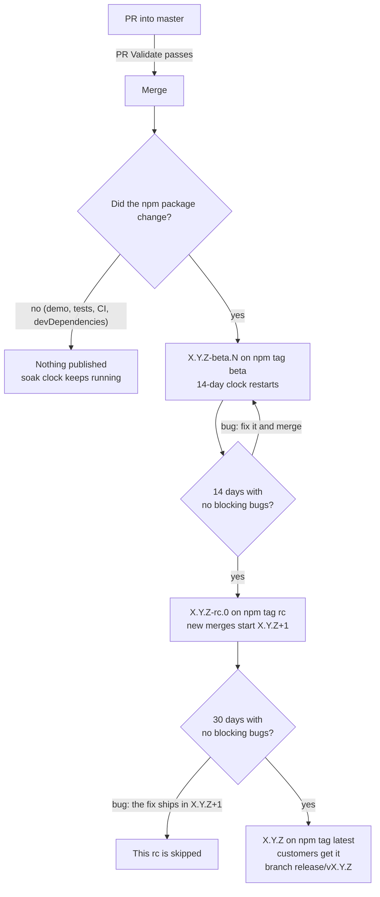
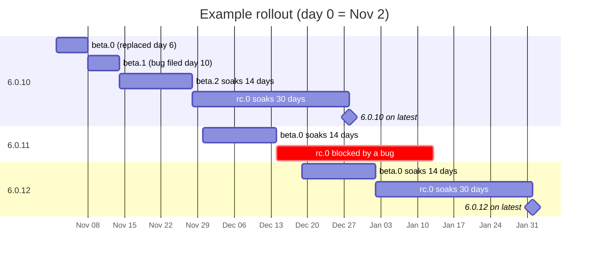

# Releasing ryuu.js

Releases are automatic. You merge PRs into `master`; GitHub Actions decides when each change is ready for customers. Nobody runs `npm publish` by hand.

- [The release cycle](#the-release-cycle)
- [The rules](#the-rules)
- [Example rollout](#example-rollout)
- [Interrupts: what happens if…](#interrupts-what-happens-if)
- [Testing it yourself](#testing-it-yourself)
- [Settings](#settings)
- [One-time setup](#one-time-setup)
- [Recovery](#recovery)

## The release cycle



| npm tag | Example | Who gets it |
|---|---|---|
| `latest` | `6.0.10` | **Customers.** `npm install ryuu.js`, CDN URLs without a version, and npm installs of ranges like `^6.0.9` |
| `rc` | `6.0.10-rc.0` | Anyone who asks for `ryuu.js@rc` |
| `beta` | `6.0.10-beta.3` | Anyone who asks for `ryuu.js@beta` |

Betas and rcs are prereleases. No package manager installs one from a normal range like `^6.0.9`, so customers only ever move to a version that passed both soaks.

## The rules

1. **Every PR** runs PR Validate (type check, tests, build, package contents). It must pass to merge.
2. **After a merge**, Release builds `master` and compares the npm package with the last one published. A changed package becomes the next beta. A merge that only touches the demo, tests, CI or devDependencies publishes nothing.
3. **Each new beta restarts the 14-day clock.** When the newest beta reaches 14 days with no blocking bugs, the same build is published as the rc. The next merge that changes the package starts the next patch version.
4. **An rc that reaches 30 days with no blocking bugs** is published as `latest`, with a `vX.Y.Z` tag and a `release/vX.Y.Z` branch. Each step ships the exact build that soaked; only the version number changes.
5. **A bug blocks a version** when it's a Jira **Bug** labeled `ryuu.js-X.Y.Z` (no `-beta`/`-rc` suffix), and it's either still unresolved, or was reported during the current soak and wasn't closed as Duplicate, Won't Do, Won't Fix, Cannot Reproduce or Not a Bug. All priorities count.
6. **Release runs** after every merge, daily at 15:23 UTC, and after every publish, but only while `RELEASE_ENABLED` is `true`. It also runs whenever you click Run workflow, whatever that setting is. Each run does at most one thing, in this order: retry a failed publish, release a soaked rc, promote a soaked beta, cut a beta.

## Example rollout

Day 0 is Nov 2. This assumes automatic releases are on and nothing is forced.



| Day | What happens | What Release does |
|---|---|---|
| 0 (Nov 2) | Merge a `src/` change | Publishes `6.0.10-beta.0` on `beta`. The 14-day clock starts |
| 3 | Merge a demo-only change | Package unchanged: publishes nothing. Clock keeps running (day 3 of 14) |
| 6 | Merge a bug fix | Publishes `6.0.10-beta.1`. **Clock restarts** |
| 10 | **Interrupt:** QA files a Bug labeled `ryuu.js-6.0.10` | Nothing yet, but the bug will block the rc while it's open |
| 12 | The fix merges; the bug is resolved as Fixed | Publishes `6.0.10-beta.2`. **Clock restarts.** The bug was reported before beta.2, so it no longer blocks |
| 26 (Nov 28) | Daily run: beta.2 is 14 days old with no blocking bugs | Publishes `6.0.10-rc.0` on `rc`. New merges now go to 6.0.11 |
| 28 | Merge a feature | Publishes `6.0.11-beta.0`. 6.0.10's rc soak isn't affected |
| 42 (Dec 14) | Daily run | Promotes `6.0.11-beta.0` to `6.0.11-rc.0` |
| 45 | **Interrupt:** a Bug is filed against `ryuu.js-6.0.11` | 6.0.11 can no longer reach `latest` (unless the bug is closed as Not a Bug, Duplicate, etc.) |
| 47 | The fix merges | Publishes `6.0.12-beta.0` |
| 56 (Dec 28) | Daily run: `6.0.10-rc.0` is 30 days old with no bugs | **Publishes `6.0.10` on `latest`.** Customers move from 6.0.9 to 6.0.10. Creates `release/v6.0.10` |
| 61 (Jan 2) | Daily run | Promotes `6.0.12-beta.0` to `6.0.12-rc.0` |
| 72 | Daily run: `6.0.11-rc.0` is 30 days old | Blocked by the day-45 bug, so it's skipped |
| 91 (Feb 1) | Daily run | **Publishes `6.0.12` on `latest`.** 6.0.11 is never released on its own; its changes ship in 6.0.12 |

## Interrupts: what happens if…

| Interrupt | Effect |
|---|---|
| **An urgent fix** has to reach customers (say, day 47) | Once `6.0.12-beta.0` is published, click Run workflow with `force_rc`. When `6.0.12-rc.0` is published, run it again with `force_ga`. `6.0.12` is on `latest` the same day. Both skip their soak **and** the Jira check. 6.0.10 and 6.0.11 then sit below `latest` and never ship separately |
| **Releases are paused** (`RELEASE_ENABLED=false`) from day 20 to 30 | Merges and daily runs do nothing. Soak clocks keep counting, because they measure time since publish. The first run after resuming (day 30) cuts `6.0.10-rc.0`, 4 days later than in the example. Merges that waited ship as a beta right after |
| **Jira is down**, or the token expired, when a promotion is due | That run fails and does nothing: no promotion, and no beta either. Every run with a promotion due keeps failing until it's fixed. After that, the next run carries on |
| **The npm publish fails** (npm outage, trusted publisher misconfigured) | The git tag exists but the version isn't on npm. Every run retries that publish before anything else. Clocks start from the real npm publish time, so no soak is shortened |
| **A bug filed against an rc is closed as Not a Bug** (or Duplicate, Won't Do…) | The block lifts. The rc continues on its original 30-day clock |
| **A bug filed during a beta soak stays open** | The rc waits. Betas keep publishing as merges land, each restarting the clock |
| **We want 6.1.0** | Open a PR that sets `master`'s `package.json` `version` to `6.1.0-beta.0`. The next merge that changes the package publishes `6.1.0-beta.0`. A 6.0.x line still in beta is abandoned; rcs already cut still continue to `latest` |
| **A merge only touches the demo, tests, CI or devDependencies** | Nothing is published, and no clock changes |

## Testing it yourself

From a local checkout. None of these push to GitHub or publish to npm.

```bash
# Unit tests for the release logic
npx jest --selectProjects ci

# What would Release do right now? (reads npm and origin/master)
git fetch origin
npm run release:plan

# ...as if it were 15 days from now
SIMULATE_NOW=+15d npm run release:plan

# ...as if your current branch were already merged
MASTER_REF=HEAD npm run release:plan

# Full rehearsal in a throwaway clone: merge → beta → tag → publish check,
# ending with `npm publish --dry-run`
npm run release:rehearse
```

When a promotion is due, `release:plan` asks Jira, so export `JIRA_BASE_URL`, `JIRA_PROJECTS`, `JIRA_EMAIL` and `JIRA_API_TOKEN` first.

On GitHub. A dry run builds and tests but pushes and publishes nothing:

```bash
gh workflow run release.yml --repo DomoApps/domo.js -f dry_run=true
gh workflow run release.yml --repo DomoApps/domo.js -f dry_run=true -f simulate_now=+15d

gh run list --workflow release.yml --repo DomoApps/domo.js --limit 3   # find the run
gh run view <run-id> --repo DomoApps/domo.js --log                    # the decision and why

npm view ryuu.js dist-tags                                             # what's published
```

Or in the UI: **Actions → Release → Run workflow**. Each run's summary page shows what it decided and why.

## Settings

Changing variables, secrets and environments needs admin access to the repo.

### Repository variables

UI: **Settings → Secrets and variables → Actions → Variables**

| Variable | Value | What it does |
|---|---|---|
| `RELEASE_ENABLED` | `true` | Merges, the daily schedule and follow-up runs release automatically. Any other value, or unset, means only runs you start by hand do anything |
| `JIRA_BASE_URL` | `https://domoinc.atlassian.net` | The Jira site that's searched for bugs |
| `JIRA_PROJECTS` | `DOMO` | Comma-separated Jira projects that are searched |

```bash
gh variable set RELEASE_ENABLED --body true  --repo DomoApps/domo.js   # turn automatic releases on
gh variable set RELEASE_ENABLED --body false --repo DomoApps/domo.js   # pause them
gh variable set JIRA_PROJECTS --body DOMO    --repo DomoApps/domo.js
gh variable list --repo DomoApps/domo.js
```

### Secrets (in the `release` environment)

UI: **Settings → Environments → release → Environment secrets**

| Secret | What it is |
|---|---|
| `RELEASE_DEPLOY_KEY` | The private half of the deploy key Release uses to push tags |
| `JIRA_EMAIL` | The Jira account Release searches as |
| `JIRA_API_TOKEN` | An API token for that account. These expire, so put rotation on a calendar |

```bash
gh secret set RELEASE_DEPLOY_KEY --env release --repo DomoApps/domo.js < ryuu-release
gh secret set JIRA_EMAIL        --env release --repo DomoApps/domo.js   # prompts for the value
gh secret set JIRA_API_TOKEN    --env release --repo DomoApps/domo.js
gh secret list --env release --repo DomoApps/domo.js
```

### Run workflow options

UI: **Actions → Release → Run workflow**

| Option | Default | What it does |
|---|---|---|
| `dry_run` | on | Plan, build, test and compare, but push and publish nothing |
| `force_rc` | off | Promote the newest beta to rc now, skipping the 14-day soak and the Jira check |
| `force_ga` | off | Release the newest rc to `latest` now, skipping the 30-day soak and the Jira check |
| `simulate_now` | empty | Dry runs only: plan as if it were `+15d` from now, or an ISO time |

```bash
gh workflow run release.yml --repo DomoApps/domo.js -f dry_run=false                 # a real run
gh workflow run release.yml --repo DomoApps/domo.js -f dry_run=false -f force_rc=true
gh workflow run release.yml --repo DomoApps/domo.js -f dry_run=false -f force_ga=true
```

### Environment variables for `npm run release:plan`

| Variable | Example | What it does |
|---|---|---|
| `SIMULATE_NOW` | `+15d`, `2026-12-01T00:00:00Z` | Plan as if it were that time |
| `MASTER_REF` | `HEAD` | Plan as if this ref were `master` (default `origin/master`) |
| `FORCE_RC`, `FORCE_GA` | `true` | Same as the Run workflow options |
| `JIRA_*` | see above | Only needed when a promotion is due |

### Changing the rules

Change these with a PR.

| To change | Edit |
|---|---|
| The soak lengths | `BETA_SOAK_DAYS` and `RC_SOAK_DAYS` in `scripts/ci/lib.ts` |
| Which Jira resolutions don't count as bugs | `NON_BUG_RESOLUTIONS` in `scripts/ci/lib.ts` |
| When the daily run happens | The `cron` line in `.github/workflows/release.yml` |
| The version line (e.g. start 6.1.0) | `version` in `master`'s `package.json`. Only its X.Y.Z is read, as a minimum |

## One-time setup

**Who can publish:** only a reviewed merge to `master`, or a repo admin. Only the deploy key and admins can create `v*` tags, and the deploy key is only available to jobs running on `master`.

1. **Environments.** In the UI: **Settings → Environments → New environment**, then under Deployment branches and tags choose Selected. Create `release` allowing branch `master`, and `npm-publish` allowing tags `v*`. Or from the CLI:
   ```bash
   for env in release npm-publish; do
     gh api -X PUT repos/DomoApps/domo.js/environments/$env \
       -F 'deployment_branch_policy[protected_branches]=false' \
       -F 'deployment_branch_policy[custom_branch_policies]=true'
   done
   gh api -X POST repos/DomoApps/domo.js/environments/release/deployment-branch-policies -f name=master -f type=branch
   gh api -X POST repos/DomoApps/domo.js/environments/npm-publish/deployment-branch-policies -f name='v*' -f type=tag
   ```
2. **Deploy key.** UI: **Settings → Deploy keys → Add deploy key**, with **Allow write access** checked. Or:
   ```bash
   ssh-keygen -t ed25519 -N '' -C ryuu-release -f ryuu-release
   gh repo deploy-key add ryuu-release.pub --allow-write --title ryuu-release --repo DomoApps/domo.js
   gh secret set RELEASE_DEPLOY_KEY --env release --repo DomoApps/domo.js < ryuu-release
   rm ryuu-release ryuu-release.pub
   ```
3. **Jira secrets and the variables** listed under [Settings](#settings). Leave `RELEASE_ENABLED` off for now.
4. **npm trusted publisher**, added by an npm maintainer of `ryuu.js`: on npmjs.com, open the package's **Settings → Trusted publishing** and add GitHub Actions with repo `DomoApps/domo.js`, workflow `publish.yml`, environment `npm-publish`. No npm token is stored anywhere. After the first publish works, set publishing access to disallow tokens.
5. **Rulesets** (UI: **Settings → Rules → Rulesets**):
   - On `master`, require the `build-test` status check.
   - On tags `v*`, restrict creations, updates and deletions.
   - On branches `release/v*`, restrict creations, updates and deletions, and block force pushes.
   - Both bypass for **Deploy keys** and the **Repository admin** role.
   - Don't add PR or linear-history rules to `release/v*`.
6. **First run.** Do a dry run, then a real run (`dry_run=false`). Check that `npm view ryuu.js dist-tags` shows the new beta and that `latest` hasn't changed. Then set `RELEASE_ENABLED=true`.

## Recovery

- **A publish failed after its tag was pushed.** The next run retries it automatically while `RELEASE_ENABLED` is on; otherwise start a run yourself. Re-running Publish on a tag that's already on npm does nothing.
- **A tag can never publish.** Its "Verify the tag" step keeps failing, which holds everything else up. It wasn't made by the pipeline. An admin deletes the tag, plus `release/vX.Y.Z` if there is one, then starts a run. **Never create `v*` tags or `release/v*` branches by hand.**
- **A push is rejected by a ruleset.** The deploy key is missing, read-only, or not in the bypass list. Nothing was pushed. Fix the key or the ruleset, then start a run.
- **An rc or GA refused because its package differs from the soaked one.** Builds have been byte-for-byte reproducible, so this means something real changed, for example the runner's toolchain. Investigate before forcing.
- **A fix to `publish.yml` or `scripts/ci/verify-tag.sh` doesn't apply to an existing tag.** Each tag runs its own copy of both files.
- **The daily run stopped.** GitHub disables scheduled workflows after 60 days without repository activity. Re-enable it under **Actions → Release**.
- **Rolling back `latest`:** an npm maintainer runs `npm dist-tag add ryuu.js@<previous> latest`. Release never moves `latest` backwards, and never releases a version at or below it.

The scripts behind the workflows live in `scripts/ci/`. The decision logic is in `lib.ts`, which the `ci` Jest project tests.
