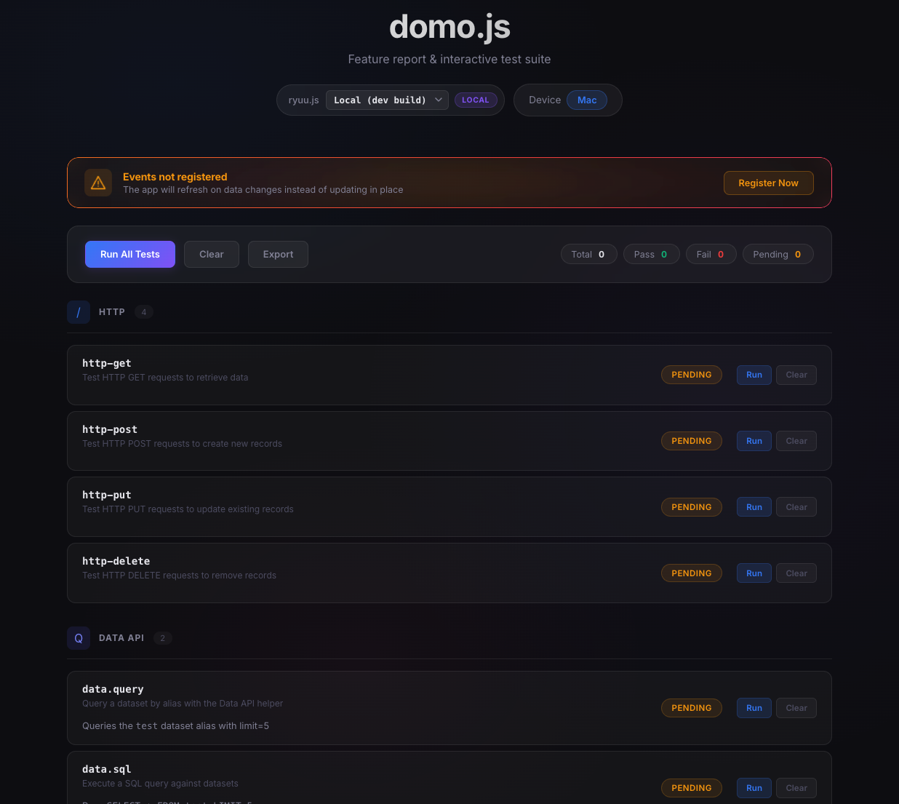

# domo.js Demo App



Interactive test suite for the `domo.js` library. Exercises every API — HTTP, Data, AppDB, events, Code Engine, Workflows, AI, and utilities — inside a real Domo iframe with a dark-themed UI, syntax-highlighted JSON rendering, and a version picker to test against any published release.

## Getting Started

1. Build the library from the project root: `npm run build`
2. Build the demo assets: `node build.js`
3. Publish to Domo: `domo publish`
4. Create a card from the app design and open it

## Version Picker

The dropdown in the header lets you switch between:
- **Local (dev build)** — the bundled `domo.js` from `dist/`
- **Any published version** — loaded from `cdn.jsdelivr.net/npm/ryuu.js@{version}`

Changing the version reloads the page. Tests that use APIs not available in older versions show "N/A" instead of failing.

## Test Categories

| Category | Tests | Description |
|---|---|---|
| **HTTP** | get, post, put, delete | CRUD against the `SanityTest` AppDB collection |
| **Data API** | data.query, data.sql | Query the `test` dataset alias |
| **AppDB** | list, create, update, remove | AppDB helpers with auto-content wrapping |
| **Events** | requestFiltersUpdate, requestVariablesUpdate, onDataUpdated, onFiltersUpdated, onVariablesUpdated, onAppDataUpdated | Event emitters and listeners |
| **Code Engine** | codeEngine | Run the `awesomeFunction` package |
| **Workflows** | workflow.start, workflow.getInstance | Start and check workflow instances |
| **AI** | ai.generateText, ai.textToSQL | Text generation and natural language to SQL |
| **Utilities** | domo.env, ios-detection | Environment context and platform detection |

## Event Registration

Event listeners (`onDataUpdated`, `onFiltersUpdated`, etc.) are not registered automatically. A warning banner at the top of the page prompts you to register them. Until registered, the app refreshes on data changes instead of updating in place.

## Sequential Dependencies

Some tests depend on prior results:
- **HTTP**: POST stores the document ID that PUT and DELETE need
- **AppDB**: create stores the ID that update and remove need
- **Workflows**: start stores the instance ID that getInstance needs

Run them in order, or use "Run All Tests" which executes them sequentially.

## Manifest Configuration

The demo's `manifest.json` includes:
- **Dataset**: `test` alias mapped to a dataset
- **Collection**: `SanityTest` for AppDB operations
- **Workflow**: `testWorkflow` alias
- **Code Engine**: `awesomeFunction` package with two number inputs and a number output

To use Code Engine and Workflow tests, wire these aliases to real resources in Domo and set a `proxyId`.

## Building

```bash
node build.js    # Copy assets to public-assets/ and rewrite index.html paths
node clean.js    # Reverse the build (delete public-assets/, restore paths)
```

The `public-assets/` directory is the layout Domo's CLI expects for upload. Source files live in `assets/`.

## Adding Tests

Add an entry to the `features` array in `assets/js/tests.js`:

```javascript
{
  name: "my-test",
  category: "http",        // determines which category group it appears in
  description: "What this test does",
  fn: async () => {
    const result = await domo.get("/my/endpoint");
    return {
      _render: "http",     // "http" | "payload" — controls how the result is displayed
      httpMethod: "GET",
      url: "/my/endpoint",
      payload: result,
      timing: "123.45ms",
    };
  },
}
```

New categories need an entry in `CATEGORY_META` in `app.js` and a `.category-icon--{name}` style in `styles.css`.
